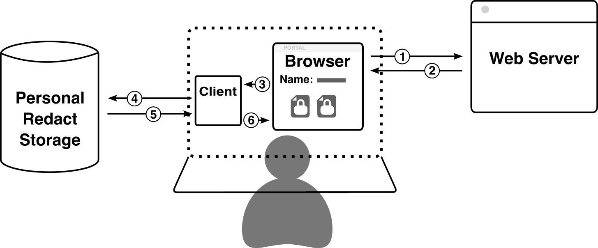

==========
 Overview
==========

The best way to begin understanding how Redact works is to understand, at a
high-level, what the general flow of information is when a user visits a
Redact-enabled website. Below is a diagram outlining this flow.

1. Alice opens her browser and visits a Redact-enabled website (e.g. www.foo.com).
2. The website's server responds with the contents of the page, which include
   ``<iframe>`` elements for instances where the website displays "Redacted" data.
3. Alice's browser issues a request to the local Redact-client for each iframe, each of
   which represents a different piece of secured data.
4. The Redact-client receives each request and forwards them to the Redact-storage.
5. The Redact-storage instance responds to each request with the data it has stored at
   that path. These pieces of data are typically encrypted and cannot be
   decrypted by the Redact-storage instance itself.
6. The Redact-client decrypts the encrypted data, then responds to the local request
   from the browser with the decrypted text in a secure iframe. The user can now 
   see the secure data, but the host website cannot.

.. _secure-iframe:

Secure ``<iframe>``
-------------------

Although there already exist several end-to-end encrypted applications in use
commercially today, none of them quite solve the problem of endpoint security.
These services provide strong security both in transit and at rest using their
encryption protocols, but there still remains the issue of displaying the actual
data to the user: data must be decrypted and placed on the screen at some point,
and existing end-to-end encryption applications maintain control over this
process. This means there is a point in the data pipeline where the user must
trust the operator of the service not to inject malicious code and exfiltrate
plaintext data.

Redact solves this issue by limiting the trusted platform to just the
browser, rather than all the websites visited on the browser. The Redact-client
leverages ``<iframe>`` elements and CSRF tokens to allow websites to easily
interact with protected data without having to, or in fact being able to,
actually see it at any point. This technique works using
technologies that are well-proven and decades old, and requires no Javascript.

The general flow to request data to be displayed works as such:

1. The website places an ``<iframe>`` element as a placeholder for the data::
     
     <iframe src="/data/.profile.firstName."></iframe>

   There are additional parameters that can be provided which further customize
   the Redact-client's response, but are left out here for simplicity.

   .. image:: _static/images/iframe_1.png
   :alt: Web page body, with the iframe reference to a Redact path

2. The Redact-client receives the request and does four things:

   1. Generates a random 256-bit session token.
   2. Attaches a session to the request.
   3. Stores the token in the session.
   4. Responds to the request with a session cookie containing the ID of the
      request's session and an HTML page containing another ``<iframe>``,
      attaching the token generated in step 1 to the end of the URL path, like
      this::

	<iframe src="/data/.profile.firstName./498DF68A39A51DE648799EE13CD26D2163863FC5F43814B8895B78BBA45935A0"></iframe>

   .. image:: _static/images/iframe_2.png
   :alt: Web page body after first iframe is rendered, with inner iframe referencing the Redact path and session token

3. Upon rendering the iframe response, the browser makes another request to the
   Redact-client, once again according to the ``src`` of the inner ``<iframe>``. 
   The Redact-client receives the request and attempts to respond with the decrypted 
   data:

   1. Retrieves the session based on the session ID provided in the request
      cookie header.
   2. Compare the token in the URL of the request with the token stored in the
      session.
   3. If the tokens match, it proceeds with fetching the requested data,
      decrypting it, and responding with an HTML page containing the
      plaintext. If the tokens do not match, the request is rejected.

   .. image:: _static/images/iframe_3.png
   :alt: Web page body after secure iframe is rendered, with the decrypted Redact data

This process allows the Redact-client to ensure that the only time it responds
with plaintext data is when the request for the data is coming from itself.

Imagine that a malicious website, acme.com, would like to exfiltrate Alice's
"Redacted" data when she visits. In order to do so, they place a script on
``acme.com`` that runs when Alice visits the website and makes an AJAX
request to the Alice's Redact-client for data at the path
``.profile.firstName.``. This request succeeds and responds with a 200 status
code, but the returned HTML just contains an ``<iframe>`` element, this time
with a token appended to the end of the ``src`` attribute. The script then makes
a second AJAX request with the token appended at the end this time.

This request will fail. It isn't enough to provide the correct token at the end
of the request path, that request must also be paired with a session that
contains the same token. This pairing occurs by attaching the session ID
returned by the Redact-client in the first request as a cookie header in the second
request. Thanks to all modern browsers' cross-origin resource sharing (CORS)
protections, it is impossible for a website located at acme.com to fetch the
session ID set by a website not at the same domain.

.. warning:: Cookies set by a domain other than the primary domain being visited
             are classified as "third-party cookies" by browser vendors.
             Browsers are increasingly placing limitations on these cookies, the
             latest being that such cookies MUST be transferred over a TLS
             connection. Currently the connection between browser and
             Redact-client, both on the user's local device, is not secured by
             TLS. In the future, it may be necessary to add a self-signed
             certificate generated by the Redact-client to the browser in order
             to secure that connection.

